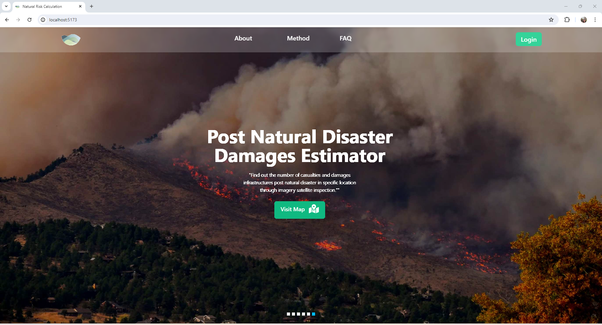
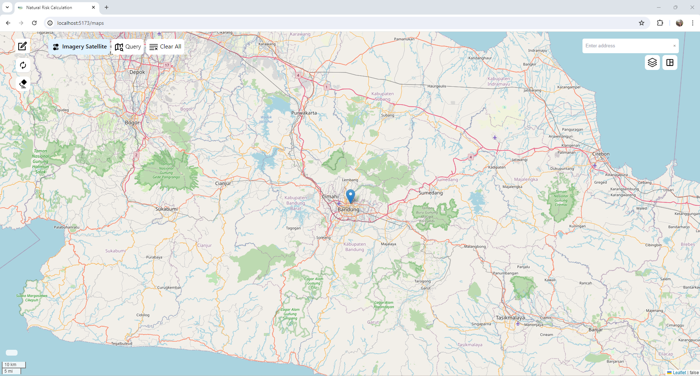
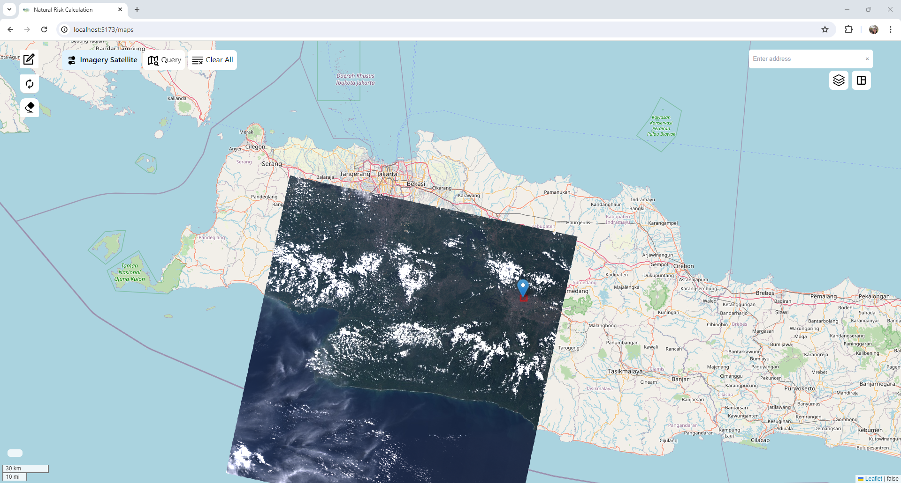
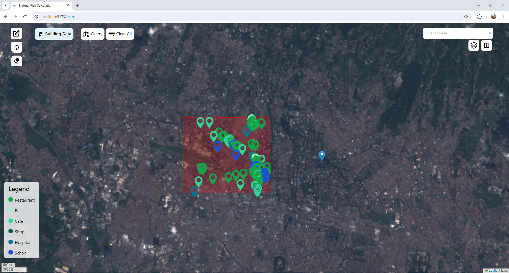
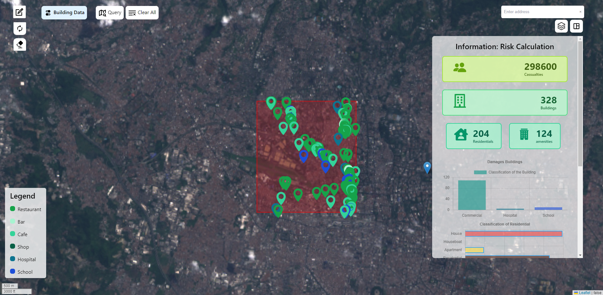
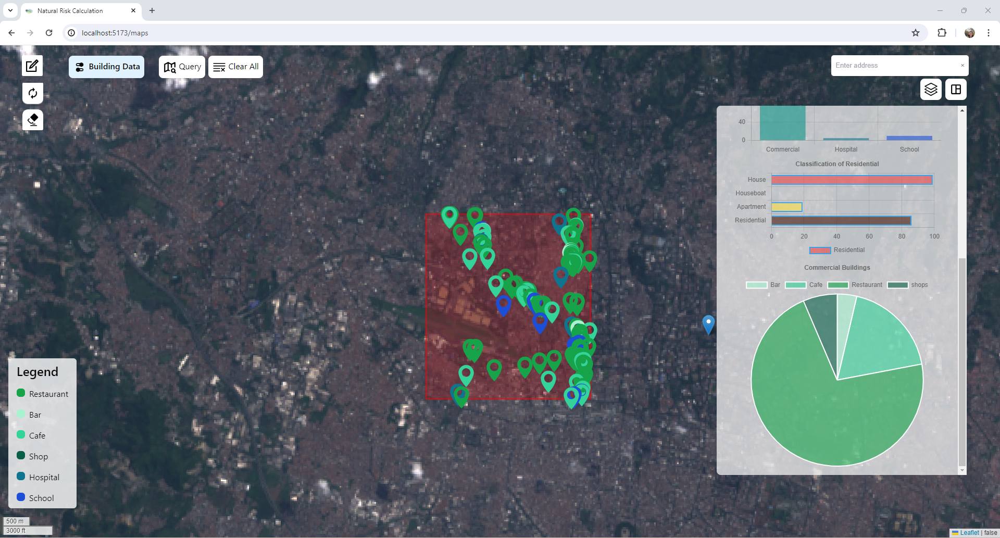

# Dashboard: Estimated value of damage caused by natural disasters

### Description

This dashboard serves the function of estimating the damage caused to building and calculating the possible casualties by natural disasters.
To know the affected location by natural disaster user could get the specific imagery satellite when the disaster happened just by inputting
the start date, end date, and the boundary of the area. The imagery satellite option will be Sentinel2, Landsat 8, and Landsat 9. Afterwards,
user could inspect the specific location and draw a rectangle to retreive the damages building and possible cassualties. The Dashboard will
provide building data such as commercial, restaurant, hospital, school, and residents. While the casualties is estimated through the grid
population model provided by world population org in the size of 100 x 100 sqm.

### Technology

The main technology use for this dashboard as follows:

1. Leaflet
2. CartoDN
3. PostgreSQL
4. Node JS / Express
5. Google Earth Engine
6. Overpassturbo

### Methods

#### Imagery Satellite

Imagery satellite provide the current earth surface information, in this case there are three types of images that will be utilized Landsat 8, Landsat 9, and Sentinel 2.
Landsat has 16 days while sentinel 2 has 10 days temporal resolution. Hence, this image data is intended to visualize the newest earth surface information. When a natural disaster
occured, the post impact will be captured in the image. The image uses three bands these are red, green, and blue with maximum value 0.4 with TOA (Top of Atmoshphere) which facilitated by GEE.

#### Population Data

The population data is provided from world population organization, each data represented with 100 x 100 sqm grid. It is stored in cloud which facilitated from Carto. This first embarkment
merely provide population data through workflow feature of Carto. The processing adds a new column which convert population column from a modelling calculation into integer then export to a table. This table has an API ide which can be access using Carto API developer feature. I make this query to sum up all the population selected from a selected boundary, query as follows:

> SELECT round(sum(population_column),0) as result FROM population_table WHERE ST_INTERSECTSBOX(geom, south-long, south-lat, north-long, north-lat);

### Building Data

The building data acquires from overpass turbo API, while the API fetch data from OSM. For this case, the building data thtat takes into account is hospital, school, residents, and commercial.
The further purpose to count the building data is to estimate the financial loss incured by the natural disaster. The building simply classify into house, commercial, and other amenities then
aggregate all the building based on the class.

### How to use it?

As the web application is not deployed, you can follow this step to run in local.

1. Create GEE access
2. Get the privatekey.json then place the file in ./backend/key/
3. Get access for CartoDN developer key and create a new .env file. input the key inside the file
4. Make a git clone, npm install for both backend and frontend
5. Create a RiskCalculation database in PostgreSQL and make a userdata table if you want to use the signup and signin route
6. run it locally using your IDE using (npm run start - backend) (npm run dev - frontend)

### Visualization of the web apps

